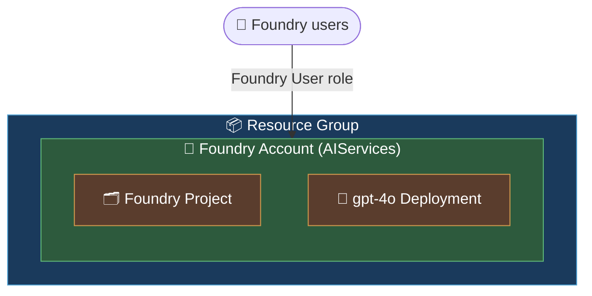
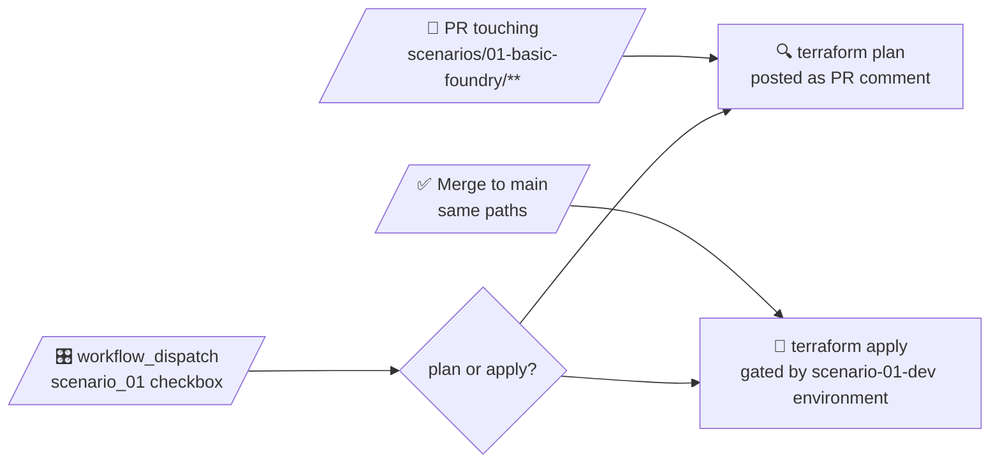

# 🧪 Scenario 01 — Basic Foundry

> The smallest interesting Foundry footprint. One resource group, one AIServices account, one project, one model deployment — and just enough RBAC and identity to actually use it.

This scenario is the "hello world" of the repo: a fully public, opinionated baseline you can stand up in a few minutes and use as a reference for the more elaborate scenarios that follow.

---

## ✨ What you get

| Resource | Type | What it does |
|---|---|---|
| 📦 Resource group | `Microsoft.Resources/resourceGroups` | Container for the whole scenario. |
| 🧠 Foundry account | `azurerm_cognitive_account` (`kind = AIServices`) | The Foundry account. Project management on, local auth **off**, system-assigned MI. |
| 🗂️ Foundry project | `azurerm_cognitive_account_project` | A single project under the account, with its own SMI. |
| 🤖 `gpt-4o` deployment | `azurerm_cognitive_deployment` | Default: `Standard` SKU, capacity `50` (≈ 50K TPM). Knobs in `variables.tf`. |
| 🔐 Foundry User RBAC | `azurerm_role_assignment` | Grants principals in `var.foundry_users` data-plane access on the account. |

Foundry API version: `2026-03-01` (via the `azurerm` provider's `cognitive_*` resources).

---

## 🗺️ Architecture



That's it. No VNet, no private endpoints, no BYO storage / Cosmos / Search / KV — those join the party in scenarios 02 and 03.

---

## 🤔 Why `azurerm` (and not `azapi`)?

Scenarios 02 and 03 lean heavily on `azapi` because they need things `azurerm` doesn't model yet: `networkInjections`, account- and project-scoped **connections**, the **capability host** child, etc. Scenario 01 has none of that.

That makes it a perfect candidate for plain `azurerm`:

- ✅ `azurerm_cognitive_account` (v4.x) now supports `kind = "AIServices"` with `project_management_enabled`, `local_auth_enabled`, custom subdomain, and SMI — everything this scenario needs.
- ✅ `azurerm_cognitive_account_project` models the project resource directly, including its own identity block.
- ✅ `azurerm_cognitive_deployment` covers model deployments with first-class `model` / `sku` blocks.
- ✅ Reads cleaner, plans cleaner, and you get azurerm's drift detection / property validation for free.

**Rule of thumb in this repo:** if `azurerm` can express the resource, use it. Drop to `azapi` only where the Foundry control plane exposes something `azurerm` hasn't caught up with yet.

> 🪜 **Heads up:** This scenario was originally `azapi`-based and migrated to `azurerm` in commit `c1eaa0a`. The `removed { }` / `import { }` blocks for that one-shot migration live in [`migrations.tf`](./migrations.tf). They've been applied — the file is kept as a worked example of how an in-place provider swap is done without touching the Azure resources. It's safe to delete (along with the `azapi` provider in `providers.tf`) in a follow-up cleanup.

---

## 🧩 Key Terraform bits worth a read

A handful of small decisions in [`main.tf`](./main.tf) make this scenario behave well in CI and play nicely with Foundry's RBAC quirks:

### `local_auth_enabled = false`
Disables key-based auth on the account. Every caller — humans, CI, agents — goes through AAD + RBAC. No keys to rotate, no keys to leak.

### `custom_subdomain_name = local.account_name`
Required for Foundry features (private endpoints, agents, etc.). Set to the same value as the account name so it stays predictable.

### `project_management_enabled = true`
The flag that turns a cognitive account into a Foundry account. Without it, no projects.

### `identity { type = "SystemAssigned" }` on both account *and* project
Both objects get their own managed identity. The account identity is used here for the role assignments; the project SMI is what your agents would assume at runtime in richer scenarios.

### Foundry User role reference by **ID**, not name
```hcl
foundry_user_role_id = "53ca6127-db72-4b80-b1b0-d745d6d5456d"
...
role_definition_id = "/providers/Microsoft.Authorization/roleDefinitions/${local.foundry_user_role_id}"
```
Microsoft is renaming Foundry RBAC roles. Referencing by **role definition ID** instead of name keeps the assignments resilient through the rename. See [the RBAC docs](https://learn.microsoft.com/azure/foundry/concepts/rbac-foundry).

### `lifecycle { ignore_changes = [model[0].version] }` on the deployment
`gpt4o_model_version` defaults to `null` — meaning "let Azure pick the region default". Azure then writes the chosen version back into state, which would otherwise show as drift on every subsequent plan. Ignoring it pins the choice to the *first* apply without locking you out of pinning explicitly later.

### `azurerm` provider with `use_oidc = true` and `storage_use_azuread = true`
The provider uses GitHub OIDC federation in CI and falls back to `az login` locally (no `ARM_*` env vars needed). State is also AAD-authed against the backend SA — shared keys are off everywhere.

---

## 🏷️ Naming (Microsoft CAF)

Pattern: `<abbr>-<workload>-<scenario>-<env>-<region>-<instance>`

| Variable | Default |
|---|---|
| `workload` | `foundry` |
| `scenario_id` | `s01` |
| `environment` | `dev` |
| `location` | `eastus2` → `eus2` |
| `instance` | `001` |

With the defaults you get:

```
📦  rg-foundry-s01-dev-eus2-001
🧠  cog-foundry-s01-dev-eus2-001
🗂️  proj-foundry-s01-dev-eus2-001
```

---

## 💾 State backend

| | |
|---|---|
| Storage account | `cmhtfstatesa` (RG `RG-TF`) |
| Container | `tfstate` |
| Key | `foundry-examples/01-basic-foundry.tfstate` |
| Auth | AAD only (shared keys disabled on the SA) |
| CI principal RBAC | **Storage Blob Data Contributor** on the SA |

---

## 🚀 Deploy locally

```powershell
az login
terraform init
terraform plan
terraform apply
```

Locally the `azurerm` provider falls back to Azure CLI auth, so `az login` is enough — no `ARM_*` env vars. In CI the same provider block picks up GitHub OIDC via `ARM_USE_OIDC` and friends.

---

## 🤖 CI/CD

Triggered by the repo-level [`deploy.yml`](../../.github/workflows/deploy.yml) workflow:



The `scenario-01-dev` GitHub Environment holds the approval gate for applies.

---

## 📤 Outputs

| Output | What it is |
|---|---|
| `resource_group_name` | RG holding the deployment |
| `foundry_account_name` / `_id` / `_endpoint` | The AIServices account |
| `foundry_project_name` / `_id` | The single project |
| `gpt4o_deployment_name` / `_capacity` | The model deployment + its TPM |

---

## 👉 Next steps

Once this is humming, look at:

- **Scenario 02** — same idea, plus BYO Storage / Cosmos / Search / KV / App Insights wired in as account-scoped connections, still on the public network.
- **Scenario 03** — Scenario 02 with VNet injection, private endpoints, and `publicNetworkAccess = Disabled` everywhere.
