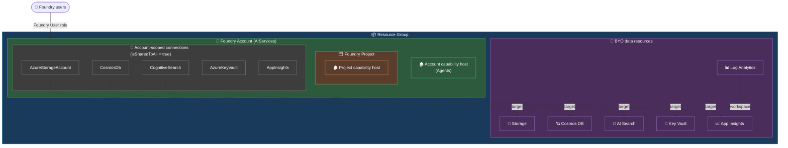
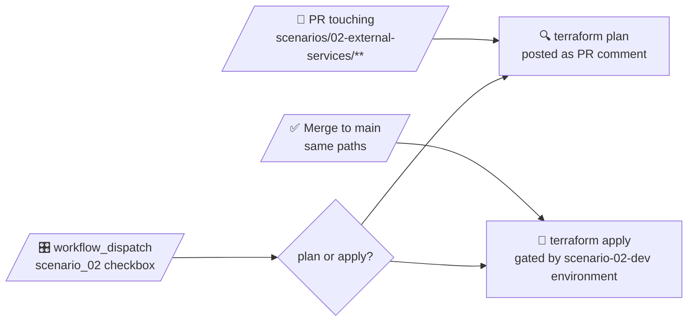

# 🧪 Scenario 02 — Foundry with external services (public network)

> Scenario 01 plus the full BYO connected-services set — Storage, Cosmos, AI Search, Key Vault, Application Insights — wired in as **account-scoped** connections so every project on the account inherits them. Still fully public.

This is the public-network sibling of scenario 03. Same data resources, same project capability host pattern, same RBAC dance — but no VNet, no private endpoints, `publicNetworkAccess = Enabled` everywhere.

---

## ✨ What you get

| Resource | Type | What it does |
|---|---|---|
| 📦 Resource group | `Microsoft.Resources/resourceGroups` | Container for the whole scenario. |
| 💾 Storage account | `azurerm_storage_account` | StorageV2 / ZRS / TLS 1.2 / shared keys off / AAD only. |
| 🪐 Cosmos DB | `azurerm_cosmosdb_account` | NoSQL, Session consistency, local auth disabled. |
| 🔎 AI Search | `azurerm_search_service` | Standard SKU, system identity. |
| 🔐 Key Vault | `azurerm_key_vault` | Standard SKU, RBAC mode, soft-delete 7 days, no purge protection. |
| 📊 Log Analytics workspace | `azurerm_log_analytics_workspace` | PerGB2018, 30-day retention. App Insights workspace target. |
| 📈 Application Insights | `azapi` `Microsoft.Insights/components` | Workspace-based (LAW above), `web` application type. azapi because `azurerm_application_insights` v4 trips a `BillingFeatures` 404 in westus3. |
| 🧠 Foundry account | `azapi` `Microsoft.CognitiveServices/accounts` | `AIServices`, project management on, local auth off, SMI. azapi because of the connections / capability host children. |
| 🤖 `gpt-4o` deployment | `azapi` `…/deployments` | Default `GlobalStandard`, capacity `50`. Knobs in `variables.tf`. |
| 🤖 `text-embedding-3-large` deployment | `azapi` `…/deployments` | Default `Standard`, capacity `50`. Knobs in `variables.tf`. |
| 🔗 Account-scoped connections | `azapi` `…/accounts/connections` | One each for Storage / Cosmos / Search / KV / App Insights. All `isSharedToAll = true`. |
| 🏠 Account capability host | `azapi` `…/accounts/capabilityHosts` | Empty `Agents` kind — documented prerequisite for the project capability host. |
| 🗂️ Foundry project | `azapi` `…/accounts/projects` | Single project with its own SMI. |
| 🏠 Project capability host | `azapi` `…/accounts/projects/capabilityHosts` | Names the inherited Storage / Cosmos / Search connections as `storageConnections` / `threadStorageConnections` / `vectorStoreConnections`. |
| 🔐 Foundry User RBAC | `azurerm_role_assignment` | Grants `var.foundry_users` data-plane access on the account. |
| 🔐 Account SMI → KV | `azurerm_role_assignment` | **Key Vault Secrets Officer** (write, not read — see [BYO Key Vault gotcha](#-byo-key-vault-must-be-the-first-connection-and-the-account-smi-needs-write)). |
| 🔐 Project SMI pre-host | `azurerm_role_assignment` × 4 | Cosmos DB Operator, Storage Blob Data Contributor, Search Index/Service Contributor. |
| 🔐 Project SMI post-host | `azurerm_role_assignment` + `azurerm_cosmosdb_sql_role_assignment` | Cosmos SQL Built-in Data Contributor, ABAC-scoped Storage Blob Data Owner on `*-azureml-agent` containers under the project GUID. |

Foundry API: `2026-03-01`. Capability host API: `2025-04-01-preview`. Connections API: `2026-03-01`.

---

## 🗺️ Architecture



The project's capability host references the connection **names** it inherits from the account. The KV and App Insights connections aren't part of the capability host triad (`storage` / `threadStorage` / `vectorStore`) — agents pick those up via inheritance only.

---

## 🤔 Why `azapi` (and not `azurerm`)?

Scenario 01 is pure `azurerm`. This scenario is mostly `azapi`. The split isn't aesthetic — it's because `azurerm` doesn't model the bits this scenario actually needs:

- ❌ **Account-scoped connections** (`Microsoft.CognitiveServices/accounts/connections`) — no `azurerm` resource.
- ❌ **Capability hosts** (account and project) — no `azurerm` resource.
- ❌ **`isSharedToAll`, `authType = AccountManagedIdentity`, connection metadata** — none of those control-plane shapes are surfaced by the `cognitive_*` resources today.
- ⚠️ **`azurerm_application_insights` v4** — fails with a `BillingFeatures` 404 in `westus3`. Dropped to `azapi` for `Microsoft.Insights/components` to dodge it (see [memory note](../../README.md)).

So the data plane (Storage, Cosmos, Search, KV, LAW) stays on `azurerm` because the resources exist there and read cleaner; everything Foundry-shaped lives on `azapi`.

**Rule of thumb in this repo:** if `azurerm` can express the resource, use it. Drop to `azapi` only where the Foundry control plane exposes something `azurerm` hasn't caught up with yet.

---

## 🪪 Identity and auth model

### Which identities exist

Two managed identities, both **system-assigned**, no user-assigned identities anywhere in this scenario:

| Identity | On | Set by | Used for |
|---|---|---|---|
| 🧠 **Account SMI** | Foundry account (`cog-…`) | `identity { type = "SystemAssigned" }` on the account `azapi_resource` | Auth for the Foundry account itself when it talks to attached services *as the account* — specifically, writing connection credentials into the BYO Key Vault. |
| 🗂️ **Project SMI** | Foundry project (`proj-…`) | `identity { type = "SystemAssigned" }` on the project `azapi_resource` | Runtime identity for agents in the project. Every data-plane call that an agent makes through an inherited connection runs as the project SMI. |

System-assigned was chosen deliberately: the lifecycle of each identity is tied to its parent (delete the account or project and Entra cleans up the principal too), and the two identities can be granted distinct least-privilege roles without sharing a blast radius.

### How connection `authType` maps to which identity authenticates

Each account-scoped connection declares an `authType` that determines who actually calls the target service:

| `authType` | Who authenticates to the target | Where the credential lives |
|---|---|---|
| `AAD` | The **caller's** AAD identity — for agent runtime calls, that's the **project SMI**. | Nowhere — Entra token at call time. |
| `AccountManagedIdentity` | The **account SMI**. | Nowhere — Entra token at call time. |
| `ApiKey` | The key itself. | Written into the BYO KV by the **account SMI** at connection-create time; read from KV at call time. |

That's why every `ApiKey`-style connection makes the account SMI's Key Vault role load-bearing — see [BYO Key Vault gotcha](#-byo-key-vault-must-be-the-first-connection-and-the-account-smi-needs-write) below.

### Required RBAC for each Foundry MI

| Resource | Connection `authType` | Identity needing RBAC | Role(s) | When | Why |
|---|---|---|---|---|---|
| 🔐 **Key Vault** | `AccountManagedIdentity` | Account SMI | `Key Vault Secrets Officer` | Before any other connection | The account SMI writes credentials (e.g. App Insights `ApiKey`) into the BYO KV. Read-only `Secrets User` works only if every other connection is AAD. |
| 💾 **Storage** | `AAD` | Project SMI | `Storage Blob Data Contributor` | Pre-capability-host | Lets the capability host create the `*-azureml-agent` containers under the project. |
| 💾 **Storage** | `AAD` | Project SMI | `Storage Blob Data Owner` (ABAC-scoped to `*-azureml-agent` containers under the project GUID) | Post-capability-host | Runtime access to thread/agent blobs. ABAC scopes it to *this* project's containers only. |
| 🪐 **Cosmos** | `AAD` | Project SMI | `Cosmos DB Operator` | Pre-capability-host | Control-plane: lets the capability host create the SQL containers / role defs. |
| 🪐 **Cosmos** | `AAD` | Project SMI | `Cosmos DB Built-in Data Contributor` (SQL data-plane role `00000000-0000-0000-0000-000000000002`, scoped to the account) | Post-capability-host | Runtime data-plane read/write on thread storage. |
| 🔎 **AI Search** | `AAD` | Project SMI | `Search Index Data Contributor` | Pre-capability-host | Lets the capability host (and agents at runtime) create / write to vector indexes. |
| 🔎 **AI Search** | `AAD` | Project SMI | `Search Service Contributor` | Pre-capability-host | Lets the capability host manage indexes/skillsets at the service scope. |
| 📈 **App Insights** | `ApiKey` | (none — key auth) | — | — | Telemetry SDKs use the connection string from the KV-stored credential. No AAD role needed on App Insights itself. |
| 🧠 **Foundry account** | n/a | `var.foundry_users` (humans) | **Foundry User** (by role ID `53ca…456d`) | At account create | Data-plane AI access on the account. Not an MI grant — this is for the humans who'll call the account/project. |

The pre/post-host split exists because some roles are needed *for* the capability host (it provisions containers / role defs at create time), while others target objects that don't exist until *after* the capability host has run (the `*-azureml-agent` containers, the project GUID in the ABAC condition, the Cosmos SQL role definitions). The [`time_sleep "wait_rbac"`](#-time_sleep-between-identity-creation-and-rbac) between the two phases lets Entra catch up before the host fires.

---

## 🧩 Key Terraform bits worth a read

A handful of decisions in [`modules/foundry-account/main.tf`](./modules/foundry-account/main.tf) and [`modules/foundry-project/main.tf`](./modules/foundry-project/main.tf) make this scenario survive Foundry's various ordering and propagation quirks.

### 🔑 BYO Key Vault must be the **first** connection, and the account SMI needs **write**

The Foundry account RP refuses to attach a BYO KV ("switching key vault") once any other connection exists, because their stored credentials are bound to the account's managed KV. So the KV connection has to land first, and every other account-scoped connection is `depends_on = [conn_key_vault]`.

The account SMI gets `Key Vault Secrets Officer` (not `Secrets User`). Once a BYO KV is attached, every subsequent connection that carries a credential — for example, the App Insights connection with `authType = ApiKey` — gets that credential **written** into the BYO KV by the account SMI. Read-only Secrets User is enough for AAD-only connections; the moment a non-AAD connection joins, you need write.

### 🏠 Account capability host before project capability host

Per Microsoft docs, a project capability host can't be created until the account has one. Ours has an empty body (`capabilityHostKind = Agents`) and exists purely to satisfy the prerequisite. The `depends_on` on the account capability host fans into every connection, so the host always lights up last on the account.

### 🪜 Inheritance ≠ free capability host

> Connections defined at the account level are inherited by new projects. However, the project capability host configuration is **not** inherited. To use those connections with Agent Service, you must create a project capability host that explicitly references the project-level connections.

That's why the project still creates a capability host. Inheritance just means we don't redefine the connection on every project — the capability host still has to name them.

### ⏱️ `time_sleep` between identity creation and RBAC

Two short waits keep the apply honest:

- `wait_account_ready` — 60s after the Foundry account is created, before any role assignment or connection runs. Lets the account SMI propagate through Entra.
- `wait_project_identity` — 30s after the project, plus a 60s `wait_rbac` after the pre-host role assignments, before the project capability host runs. The capability host provisions containers and role defs and won't wait politely for RBAC to land.

### 🧬 Pre- and post-capability-host RBAC

The project SMI needs two phases of role assignments:

- **Pre-host:** Cosmos DB Operator, Storage Blob Data Contributor, Search Index Data Contributor, Search Service Contributor. Granted before the capability host so it can create containers / role defs / indexes.
- **Post-host:** Cosmos SQL Built-in Data Contributor on the SQL data-plane role, and a Storage Blob Data Owner with an **ABAC condition** scoped to `*-azureml-agent` containers under the project's GUID. The capability host has to exist first because that's what materializes the project GUID and the containers it scopes.

### 🔐 Foundry User role reference by **ID**, not name

```hcl
foundry_user_role_id = "53ca6127-db72-4b80-b1b0-d745d6d5456d"
...
role_definition_id = "/providers/Microsoft.Authorization/roleDefinitions/${local.foundry_user_role_id}"
```

Microsoft is renaming Foundry RBAC roles. Referencing by **role definition ID** instead of name keeps the assignments resilient through the rename. See [the RBAC docs](https://learn.microsoft.com/azure/foundry/concepts/rbac-foundry).

### 🧹 Destroy-time purge

Cognitive Services accounts soft-delete on destroy and the deleted record reserves the name until purged. A 60s `time_sleep` on destroy + an `azapi_resource_action` `DELETE` against `deletedAccounts` clears the name immediately. (Scenario 03 needs 900s instead — it has a VNet subnet association to release first.) The Key Vault is handled by the `azurerm` provider's `purge_soft_delete_on_destroy = true`.

---

## 🏗️ Module layout

```text
scenarios/02-external-services/
├── providers.tf, variables.tf, main.tf, outputs.tf, terraform.auto.tfvars
└── modules/
    ├── data-resources/     # Storage + Cosmos + AI Search + KV + LAW + App Insights
    ├── foundry-account/    # Account + 2 model deployments + 5 account-scoped
    │                       # connections + Foundry User RBAC + KV RBAC +
    │                       # account capability host + destroy-time purge
    └── foundry-project/    # Project + pre/post-host RBAC + project capability host
```

Module composition lives in [`main.tf`](./main.tf). Each child module has its own `variables.tf` / `main.tf` / `outputs.tf` and declares its own `required_providers` block.

---

## 🏷️ Naming (Microsoft CAF)

Pattern: `<abbr>-<workload>-<scenario>-<env>-<region>-<instance>`

| Variable | Default |
|---|---|
| `workload` | `foundry` |
| `scenario_id` | `s02` |
| `environment` | `dev` |
| `location` | `westus3` → `wus3` |
| `instance` | `001` |

With the defaults you get:

```
📦  rg-foundry-s02-dev-wus3-001
🧠  cog-foundry-s02-dev-wus3-001
🗂️  proj-foundry-s02-dev-wus3-001
🪐  cosno-foundry-s02-dev-wus3-001
🔎  srch-foundry-s02-dev-wus3-001
💾  stfoundrys02devwus3001        (flattened — st + base name minus hyphens, ≤24 chars)
🔐  kv-foundrys02devwus3001       (flattened — KV name must be ≤24 chars)
📊  log-foundry-s02-dev-wus3-001
📈  appi-foundry-s02-dev-wus3-001
```

---

## 💾 State backend

| | |
|---|---|
| Storage account | `cmhtfstatesa` (RG `RG-TF`) |
| Container | `tfstate` |
| Key | `foundry-examples/02-external-services.tfstate` |
| Auth | AAD only (shared keys disabled on the SA) |
| CI principal RBAC | **Storage Blob Data Contributor** on the SA |

---

## 🚀 Deploy locally

```powershell
az login
terraform init
terraform plan
terraform apply
```

Locally the `azurerm` provider falls back to Azure CLI auth, so `az login` is enough — no `ARM_*` env vars. In CI the same provider block picks up GitHub OIDC via `ARM_USE_OIDC` and friends.

---

## 🤖 CI/CD

Triggered by the repo-level [`deploy.yml`](../../.github/workflows/deploy.yml) workflow:



The `scenario-02-dev` GitHub Environment holds the approval gate for applies.

---

## 📤 Outputs

| Output | What it is |
|---|---|
| `resource_group_name` | RG holding the deployment |
| `foundry_account_name` / `_id` / `_endpoint` | The AIServices account |
| `foundry_project_name` / `_id` | The single project |
| `storage_account_name` | BYO Storage |
| `cosmos_account_name` | BYO Cosmos |
| `ai_search_name` | BYO AI Search |
| `key_vault_name` / `key_vault_uri` | BYO Key Vault |
| `app_insights_name` | BYO Application Insights |
| `log_analytics_workspace_id` | LAW backing App Insights |

---

## 👉 Next steps

- Assign developers who want to create / edit agents in this project the **Foundry User** role at the **project** scope (the account-scope grant is for data-plane AI access on the account itself).
- Look at **Scenario 03** — same shape as this one, plus VNet injection, private endpoints, and `publicNetworkAccess = Disabled` everywhere.
- Look back at **Scenario 01** if you want to see how lean the setup gets without BYO services.
