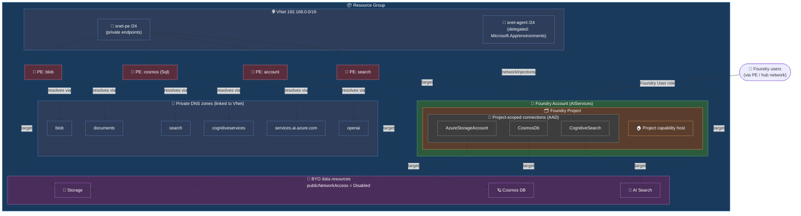
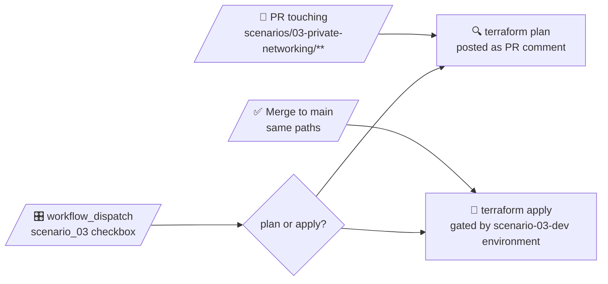

# 🧪 Scenario 03 — Foundry with private networking

> Scenario 02's external-services shape, but locked down: VNet-injected Foundry account, private endpoints for every dependency, AAD-only data plane, and `publicNetworkAccess = Disabled` end-to-end.

Modeled on Microsoft's [`15a-private-network-standard-agent-setup`](https://github.com/microsoft-foundry/foundry-samples/tree/main/infrastructure/infrastructure-setup-terraform/15a-private-network-standard-agent-setup) reference but reorganized into composable per-concern modules so each piece (network, data resources, account, private endpoints, project) can be reasoned about — and broken — in isolation.

---

## ✨ What you get

| Resource | Type | What it does |
|---|---|---|
| 📦 Resource group | `Microsoft.Resources/resourceGroups` | Container for the whole scenario. |
| 🌐 VNet | `azurerm_virtual_network` | One /16 (`192.168.0.0/16` by default) hosting both subnets. |
| 🧱 `snet-agent` | `azurerm_subnet` | /24 delegated to `Microsoft.App/environments` — host for Standard Agent compute, attached via the Foundry account's `networkInjections`. |
| 🧱 `snet-pe` | `azurerm_subnet` | /24 for the private endpoints. No delegation. |
| 🧭 6× private DNS zones | `azurerm_private_dns_zone` + `…_virtual_network_link` | `privatelink.{blob.core.windows.net, documents.azure.com, search.windows.net, cognitiveservices.azure.com, services.ai.azure.com, openai.azure.com}` — all linked to the VNet, no auto-registration. |
| 💾 Storage account | `azurerm_storage_account` | StorageV2 / ZRS / TLS 1.2 / shared keys off / `public_network_access_enabled = false` / Deny default rules. |
| 🪐 Cosmos DB | `azurerm_cosmosdb_account` | NoSQL, Session consistency, local auth disabled, `public_network_access_enabled = false`. |
| 🔎 AI Search | `azapi` `Microsoft.Search/searchServices` | Standard SKU, system identity, `publicNetworkAccess = Disabled`, `networkRuleSet.bypass = None`. |
| 🧠 Foundry account | `azapi` `Microsoft.CognitiveServices/accounts` | `AIServices`, `allowProjectManagement = true`, `disableLocalAuth = true`, `publicNetworkAccess = Disabled`, `networkAcls.defaultAction = Deny`, `networkInjections` pointing at `snet-agent`. |
| 🤖 `gpt-4o` deployment | `azapi` `…/deployments` | Default `GlobalStandard`, capacity `50`. Knobs in `variables.tf`. |
| 🤖 `text-embedding-3-large` deployment | `azapi` `…/deployments` | Default `Standard`, capacity `50`. Knobs in `variables.tf`. |
| 🗂️ Foundry project | `azapi` `…/accounts/projects` | Single project, own SMI, display name + description. |
| 🔗 Project-scoped connections | `azapi` `…/accounts/projects/connections` | One each for Cosmos / Storage / Search. All `authType = AAD`. |
| 🏠 Project capability host | `azapi` `…/accounts/projects/capabilityHosts` | Names the three connections as `vectorStoreConnections` / `storageConnections` / `threadStorageConnections`. |
| 🚪 4× private endpoints | `azurerm_private_endpoint` | One each for Storage blob, Cosmos Sql, AI Search, and the Foundry account (with **three** DNS zones — cognitiveservices, services.ai.azure.com, openai.azure.com). |
| 🔐 Foundry User RBAC | `azurerm_role_assignment` | Grants `var.foundry_users` data-plane access on the account. |
| 🔐 Project SMI pre-host | `azurerm_role_assignment` × 4 | Cosmos DB Operator, Storage Blob Data Contributor, Search Index/Service Contributor. |
| 🔐 Project SMI post-host | `azurerm_role_assignment` + `azurerm_cosmosdb_sql_role_assignment` | Cosmos SQL Built-in Data Contributor, ABAC-scoped Storage Blob Data Owner on `*-azureml-agent` containers under the project GUID. |

Foundry API: `2026-03-01`. Capability host API: `2025-04-01-preview` (no GA path yet). Search API: `2025-05-01`.

---

## 🗺️ Architecture



Two subnets, six DNS zones, four private endpoints. The Foundry account doesn't get its own egress subnet — agent compute lands in `snet-agent` via `networkInjections`, and all *inbound* traffic to the account, Storage, Cosmos, and Search arrives through the PEs in `snet-pe`.

---

## 🤔 Why `azapi` (and not `azurerm`)?

Same answer as scenario 02, with one extra: this scenario *also* needs `networkInjections`.

- ❌ **`networkInjections`** on the Foundry account — no `azurerm` resource.
- ❌ **Project-scoped connections** (`Microsoft.CognitiveServices/accounts/projects/connections`) — no `azurerm` resource.
- ❌ **Capability hosts** — no `azurerm` resource.
- ❌ **`publicNetworkAccess = Disabled` + `networkAcls`** on a Foundry account via `azurerm_cognitive_account` — surfaced, but tangled together with other properties in ways that fight the `networkInjections` body shape.
- ⚠️ **AI Search** — `azurerm_search_service` exists, but the combination of `publicNetworkAccess`, `networkRuleSet.bypass = None`, and `authOptions.aadOrApiKey` reads more cleanly on `azapi` for a small enough resource that consistency wins.

So Storage and Cosmos stay on `azurerm` (the property surface is fine there), and everything Foundry- or network-policy-shaped lives on `azapi`.

**Rule of thumb in this repo:** if `azurerm` can express the resource, use it. Drop to `azapi` only where the Foundry control plane exposes something `azurerm` hasn't caught up with yet.

---

## 🪪 Identity and auth model

### Which identities exist

Two managed identities — both **system-assigned**, no user-assigned identities anywhere:

| Identity | On | Set by | Used for |
|---|---|---|---|
| 🧠 **Account SMI** | Foundry account (`cog-…`) | `identity { type = "SystemAssigned" }` on the account `azapi_resource` | Standard Agent infra inside `snet-agent` runs as the account context. No KV write role here because every connection in this scenario is AAD (see below). |
| 🗂️ **Project SMI** | Foundry project (`proj-…`) | `identity { type = "SystemAssigned" }` on the project `azapi_resource` | Runtime identity for agents. Every data-plane call through an inherited connection runs as the project SMI. |

System-assigned was chosen for the same reason as scenarios 01 and 02: lifecycle-bound, distinct blast radii, no key rotation.

### How connection `authType` maps to which identity authenticates

| `authType` | Who authenticates to the target | Where the credential lives |
|---|---|---|
| `AAD` | The **caller's** AAD identity — for agent runtime calls, that's the **project SMI**. | Nowhere — Entra token at call time. |

That's the whole table for this scenario. All three connections (Cosmos / Storage / Search) are `AAD`, which is why — unlike scenario 02 — there's no BYO Key Vault and no `Key Vault Secrets Officer` role on the account SMI. No `ApiKey` connection means no credential to write into a vault.

### Required RBAC for each Foundry MI

| Resource | Connection `authType` | Identity needing RBAC | Role(s) | When | Why |
|---|---|---|---|---|---|
| 💾 **Storage** | `AAD` | Project SMI | `Storage Blob Data Contributor` | Pre-capability-host | Lets the capability host create the `*-azureml-agent` containers under the project. |
| 💾 **Storage** | `AAD` | Project SMI | `Storage Blob Data Owner` (ABAC-scoped to `*-azureml-agent` containers under the project GUID) | Post-capability-host | Runtime access to thread/agent blobs. ABAC scopes it to *this* project's containers only. |
| 🪐 **Cosmos** | `AAD` | Project SMI | `Cosmos DB Operator` | Pre-capability-host | Control plane — lets the capability host create the SQL containers / role defs. |
| 🪐 **Cosmos** | `AAD` | Project SMI | `Cosmos DB Built-in Data Contributor` (SQL data-plane role `00000000-0000-0000-0000-000000000002`, scoped to the account) | Post-capability-host | Runtime data-plane read/write on thread storage. |
| 🔎 **AI Search** | `AAD` | Project SMI | `Search Index Data Contributor` | Pre-capability-host | Lets the capability host (and agents at runtime) create / write to vector indexes. |
| 🔎 **AI Search** | `AAD` | Project SMI | `Search Service Contributor` | Pre-capability-host | Lets the capability host manage indexes/skillsets at the service scope. |
| 🧠 **Foundry account** | n/a | `var.foundry_users` (humans) | **Foundry User** (by role ID `53ca…456d`) | At account create | Data-plane AI access on the account. Not an MI grant — this is for the humans who'll call the account/project (over the PE or a peered hub). |

The pre/post-host split is the same idea as scenario 02: some roles are needed *for* the capability host (it provisions containers / role defs at create time), while others target objects that don't exist until *after* the capability host has run (the `*-azureml-agent` containers, the project GUID for the ABAC condition, the Cosmos SQL role definitions). A [`time_sleep "wait_rbac"`](#%EF%B8%8F-time_sleeps-everywhere) between the two phases lets Entra catch up before the host fires.

---

## 🧩 Key Terraform bits worth a read

A handful of decisions in [`modules/foundry-account/main.tf`](./modules/foundry-account/main.tf) and [`modules/foundry-project/main.tf`](./modules/foundry-project/main.tf) keep this scenario alive across the various network/async/SAL quirks.

### 🪜 Connections live on the **project**, not the account

Scenario 02 attaches its BYO services as **account-scoped** connections (so every project inherits them). Scenario 03 follows Microsoft's private-network reference and puts them on the **project** instead. There's no account-level capability host in this scenario — only a project-level one.

Trade-off: connections aren't shared across projects, but the wiring is simpler (no `isSharedToAll`, no two-phase capability host) and the data resources are 1:1 with this project's blast radius.

### 🌐 `networkInjections` + `snet-agent` delegation

```hcl
networkInjections = [
  {
    scenario                   = "agent"
    subnetArmId                = var.agent_subnet_id
    useMicrosoftManagedNetwork = false
  }
]
```

The agent subnet has to be delegated to `Microsoft.App/environments` *before* the account is created — that's why the `network` module runs first and the account depends on its output. `useMicrosoftManagedNetwork = false` means the Container Apps environment behind the Standard Agent lives in *your* VNet, not a Microsoft-managed one.

### ⏱️ 5-minute `wait_account_ready` (and why it's not the usual 60s)

```hcl
resource "time_sleep" "wait_account_ready" {
  depends_on      = [azapi_resource.foundry_account]
  create_duration = "300s"
}
```

`azapi` reports the account "created" once ARM accepts the PUT, but the `networkInjections`-driven Container Apps environment continues provisioning asynchronously. Child operations like attaching the account's private endpoint fail with `AccountProvisioningStateInvalid` until the account reaches `Succeeded` — observed at >3 min after `azapi` returned success on a fresh wus3 deploy. 300s is the empirical floor; scenario 02 gets away with 60s because there's no `networkInjections` to wait on. (See also the [memory note on the Foundry account provisioning race](../../memory.md) if you've got the auto-memory pulled in.)

### 🚪 The Foundry private endpoint wires three DNS zones

```hcl
private_dns_zone_group {
  name = "default"
  private_dns_zone_ids = [
    var.dns_zone_id_cognitive_services,
    var.dns_zone_id_ai_services,
    var.dns_zone_id_openai,
  ]
}
```

The single `account` PE has to resolve three different DNS suffixes — Foundry exposes APIs under `cognitiveservices.azure.com`, `services.ai.azure.com`, and `openai.azure.com` — so the zone group bundles all three. The other three PEs (blob, cosmos Sql, search) are single-zone.

### 🧬 Pre- and post-capability-host RBAC

The project SMI needs two phases of role assignments:

- **Pre-host:** Cosmos DB Operator, Storage Blob Data Contributor, Search Index Data Contributor, Search Service Contributor. Granted before the capability host so it can create containers / role defs / indexes.
- **Post-host:** Cosmos SQL Built-in Data Contributor on the SQL data-plane role, and a Storage Blob Data Owner with an **ABAC condition** scoped to `*-azureml-agent` containers under the project's GUID. The capability host has to exist first because that's what materializes the project GUID and the containers it scopes.

The project's `internalId` comes back as a 32-char hex blob; the module reformats it into a UUID for the ABAC condition:

```hcl
project_id_guid = "${substr(internal_id_raw, 0, 8)}-${substr(internal_id_raw, 8, 4)}-..."
```

### ⏱️ `time_sleep`s everywhere

Three short waits keep the apply honest:

- `wait_account_ready` — 300s after the Foundry account is created (above).
- `wait_project_identity` — 30s after the project, before its role assignments fire. Lets the project SMI propagate through Entra.
- `wait_rbac` — 60s after the pre-host role assignments, before the project capability host runs. The capability host provisions containers / role defs and won't wait politely for RBAC to land.

### 🔐 Foundry User role reference by **ID**, not name

```hcl
foundry_user_role_id = "53ca6127-db72-4b80-b1b0-d745d6d5456d"
...
role_definition_id = "/providers/Microsoft.Authorization/roleDefinitions/${local.foundry_user_role_id}"
```

Microsoft is renaming Foundry RBAC roles. Referencing by **role definition ID** instead of name keeps the assignments resilient through the rename. See [the RBAC docs](https://learn.microsoft.com/azure/foundry/concepts/rbac-foundry).

### 🧹 Destroy-time: 900s SAL cooldown + soft-deleted account purge

```hcl
resource "time_sleep" "purge_cooldown" {
  destroy_duration = "900s"
  triggers = { account_name = local.account_name }
}

resource "azapi_resource_action" "purge_on_destroy" {
  type        = "Microsoft.CognitiveServices/locations/resourceGroups/deletedAccounts@2025-06-01"
  resource_id = "/subscriptions/.../deletedAccounts/${local.account_name}"
  method      = "DELETE"
  when        = "destroy"
  depends_on  = [time_sleep.purge_cooldown]
}
```

Deleting a Foundry account leaves a soft-deleted record **and** a service association link (SAL) on `snet-agent` — Terraform can't delete the subnet until the SAL is released. The 900s `destroy_duration` lets the Foundry control plane release the SAL; the `azapi_resource_action` then purges the deleted record so the name can be reused immediately. Scenario 02's destroy needs only 60s for the same purge — it has no SAL to wait on.

> 🐢 **Heads up:** destroys will sit near "completed" for ~15 min while the SAL releases. That's expected — don't kill it.

---

## 🏗️ Module layout

```text
scenarios/03-private-networking/
├── providers.tf, variables.tf, main.tf, outputs.tf, terraform.auto.tfvars
└── modules/
    ├── network/             # VNet + 2 subnets + 6 DNS zones + VNet links
    ├── data-resources/      # Storage + Cosmos + AI Search (all public access off)
    ├── foundry-account/     # Account (networkInjections) + 2 model deployments
    │                        # + 300s wait + 900s destroy cooldown + purge
    ├── private-endpoints/   # 4 PEs (blob / cosmos / search / foundry) + DNS zone groups
    └── foundry-project/     # Project + 3 AAD connections + pre/post-host RBAC
                             # + project capability host
```

Module composition lives in [`main.tf`](./main.tf). Each child module has its own `variables.tf` / `main.tf` / `outputs.tf` and declares its own `required_providers` block. The `foundry_project` module is `depends_on = [module.private_endpoints]` so the project is only created once inbound networking is in place.

---

## 🏷️ Naming (Microsoft CAF)

Pattern: `<abbr>-<workload>-<scenario>-<env>-<region>-<instance>`

| Variable | Default |
|---|---|
| `workload` | `foundry` |
| `scenario_id` | `s03` |
| `environment` | `dev` |
| `location` | `westus3` → `wus3` |
| `instance` | `001` |

With the defaults you get:

```
📦  rg-foundry-s03-dev-wus3-001
🌐  vnet-foundry-s03-dev-wus3-001
🧱  snet-agent  /  snet-pe
🧠  cog-foundry-s03-dev-wus3-001
🗂️  proj-foundry-s03-dev-wus3-001
🪐  cosno-foundry-s03-dev-wus3-001
🔎  srch-foundry-s03-dev-wus3-001
💾  stfoundrys03devwus3001         (flattened — st + base name minus hyphens, ≤24 chars)
🚪  pep-{blob,cosmos,search,foundry}-foundry-s03-dev-wus3-001
🏠  caphost-foundry-s03-dev-wus3-001
```

---

## 🌐 Network defaults

| Variable | Default | Notes |
|---|---|---|
| `vnet_address_space` | `192.168.0.0/16` | One VNet, no peering wired in by default. |
| `agent_subnet_prefix` | `192.168.0.0/24` | Delegated to `Microsoft.App/environments`. |
| `private_endpoint_subnet_prefix` | `192.168.1.0/24` | No delegation; private endpoint NICs live here. |

If you're peering this VNet into a hub, point the hub's DNS at the six `privatelink.*` zones or use a forwarder — the zones in this scenario are linked **only** to the scenario VNet.

---

## 💾 State backend

| | |
|---|---|
| Storage account | _your state SA_ (see [`docs/bootstrap.md`](../../docs/bootstrap.md)) |
| Container | `tfstate` |
| Key | `foundry-examples/03-private-networking.tfstate` |
| Auth | AAD only (shared keys disabled on the SA) |
| CI principal RBAC | **Storage Blob Data Contributor** on the SA |

The concrete storage account name / resource group / region are environment-specific — point this at whatever SA you stood up when you bootstrapped your fork.

---

## 🚀 Deploy locally

```powershell
az login
terraform init
terraform plan
terraform apply
```

Locally the `azurerm` provider falls back to Azure CLI auth, so `az login` is enough — no `ARM_*` env vars. In CI the same provider block picks up GitHub OIDC via `ARM_USE_OIDC` and friends.

> ⏰ **Apply timing:** expect ~15-20 min. The 300s `wait_account_ready` is the longest single pause, but the project capability host itself can take another few minutes to materialize containers and role defs.

---

## 🤖 CI/CD

Triggered by the repo-level [`deploy.yml`](../../.github/workflows/deploy.yml) workflow:



The `scenario-03-dev` GitHub Environment holds the approval gate for applies.

---

## 📤 Outputs

| Output | What it is |
|---|---|
| `resource_group_name` | RG holding the deployment |
| `vnet_id` / `agent_subnet_id` / `private_endpoint_subnet_id` | The network surface |
| `foundry_account_name` / `_id` | The AIServices account |
| `foundry_project_name` / `_id` | The single project |
| `storage_account_name` | BYO Storage (agent data) |
| `cosmos_account_name` | BYO Cosmos (agent threads) |
| `ai_search_name` | BYO AI Search (vector store) |

---

## 👉 Next steps

- Assign developers who want to create / edit agents in this project the **Foundry User** role at the **project** scope (the account-scope grant is for data-plane AI access on the account itself). They'll need network reachability — either a jumpbox / hub VNet peered in, or the private endpoints exposed via your existing private DNS.
- Look back at **Scenario 02** if you want the same BYO-services shape *without* the network isolation — it's a useful reference for which pieces are intrinsic to Foundry vs. which only exist because of the lockdown here.
- Look at **Scenario 01** if you want to see how lean the setup gets without BYO services *or* a network.
