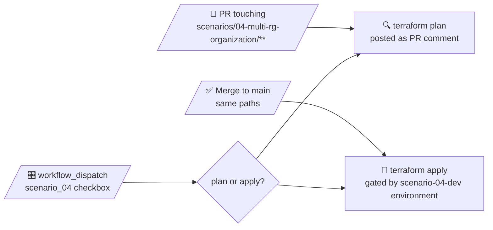

# 🧪 Scenario 04 — Multi-RG organization

> Same private-networking shape as [scenario 03](../03-private-networking/README.md), but the resources are split across **four resource groups** along lifecycle and ownership boundaries — the way you'd run this in a real Azure landing zone.

The goal here isn't to add capability; it's to demonstrate the **resource-organization refactor** Microsoft recommends in the [Cloud Adoption Framework](https://learn.microsoft.com/azure/cloud-adoption-framework/ai/ready) and the [AI platform sharing decision guidance](https://learn.microsoft.com/azure/cloud-adoption-framework/ai/platform/ai-platform-sharing-isolation-colocation). Scenario 03 collapses everything into one RG for lab simplicity; scenario 04 splits it the way teams, owners, and deploy cadences actually diverge in production.

---

## 🧭 The split, at a glance

| RG | What's in it | Owner / lifecycle | Why it's separate |
|---|---|---|---|
| 📦 `rg-net-…` | VNet, two subnets, **all 6 private DNS zones**, DNS-to-VNet links | Platform / network team. Long-lived; often pre-exists as part of a connectivity subscription. | DNS zones are routinely shared across many workloads. You don't want to rebuild them when an AI workload is torn down. CAF "AI Ready" treats the network as foundation, not workload. |
| 📦 `rg-data-…` | Storage account, Cosmos DB, AI Search, **+ their private endpoints** | Data platform team. May pre-exist as true BYO. | Foundry's standard-agent BYO model is explicitly designed for these three to live anywhere — the capability host takes full ARM IDs. Backup, DR, and cost story are independent of the AI workload. |
| 📦 `rg-ai-…` | Foundry account, model deployments, Foundry project, project capability host, **+ the account's private endpoint** | AI workload team. Per [CAF AI platform sharing](https://learn.microsoft.com/azure/cloud-adoption-framework/ai/platform/ai-platform-sharing-isolation-colocation), production default is **one Foundry per workload**. | The Foundry account *is* the AI platform instance — its own network, identity, and quota boundary. This is the RG that gets torn down or redeployed per workload. |
| 📦 `rg-obs-…` | Log Analytics workspace, App Insights component | Platform / observability team. Long-lived; the LAW is usually shared across many workloads. | Observability is a horizontal concern. The workspace and App Insights survive workload teardown so historical telemetry isn't lost. Often shared across multiple AI workloads in the same business unit. |

Private endpoints follow their **target resource** into its RG (rather than living with the VNet), which is the more common Azure pattern — easier RBAC, and the PE's auto-created DNS A-record writes into the zone in `rg-net` cross-RG without any extra wiring.

> ❓ **"Why isn't the project in its own RG?"** It can't be. The project is an ARM child of the account (`Microsoft.CognitiveServices/accounts/projects`) and inherits its parent's RG. That's by design — CAF says the project is the *in-product* segmentation mechanism *within* a shared Foundry account, so they have the same lifecycle by definition.

---

## 🗺️ Architecture

```mermaid
flowchart TB
  subgraph RGNET["📦 rg-net (platform / network team)"]
    direction TB
    subgraph VNET["🌐 VNet 192.168.0.0/16"]
      direction TB
      SNETA["🧱 snet-agent /24<br/>(delegated: Microsoft.App/environments)"]
      SNETP["🧱 snet-pe /24<br/>(private endpoints)"]
    end
    subgraph DNS["🧭 Private DNS zones (linked to VNet)"]
      direction LR
      DZB["blob"]
      DZC["documents"]
      DZS["search"]
      DZCS["cognitiveservices"]
      DZAI["services.ai.azure.com"]
      DZOAI["openai"]
    end
  end

  subgraph RGDATA["📦 rg-data (data platform team)"]
    direction TB
    subgraph DATA["💼 BYO data resources<br/>publicNetworkAccess = Disabled"]
      direction LR
      ST["💾 Storage"]
      COSMOS["🪐 Cosmos DB"]
      SEARCH["🔎 AI Search"]
    end
    PEB["🚪 PE: blob"]
    PEC["🚪 PE: cosmos (Sql)"]
    PES["🚪 PE: search"]
  end

  subgraph RGAI["📦 rg-ai (AI workload team)"]
    direction TB
    subgraph ACC["🧠 Foundry Account (AIServices)<br/>publicNetworkAccess = Disabled<br/>networkInjections → snet-agent"]
      direction TB
      subgraph PROJ["🗂️ Foundry Project (ARM child — same RG)"]
        CHP["🏠 Project capability host"]
        subgraph CONNS["🔗 Project-scoped connections"]
          direction LR
          CCOS["CosmosDb (AAD)"]
          CST["AzureStorageAccount (AAD)"]
          CSRCH["CognitiveSearch (AAD)"]
          CAPPI["AppInsights (ApiKey)"]
        end
      end
    end
    PEF["🚪 PE: account"]
  end

  subgraph RGOBS["📦 rg-obs (platform / observability team)"]
    direction LR
    LAW["📊 Log Analytics workspace"]
    APPI["📈 App Insights<br/>(workspace-based)"]
    APPI -. logs/metrics .-> LAW
  end

  SNETP --- PEB & PEC & PES & PEF
  SNETA -. networkInjections .- ACC

  PEB -. target .-> ST
  PEC -. target .-> COSMOS
  PES -. target .-> SEARCH
  PEF -. target .-> ACC

  PEB -. "A-record (cross-RG)" .-> DZB
  PEC -. "A-record (cross-RG)" .-> DZC
  PES -. "A-record (cross-RG)" .-> DZS
  PEF -. "A-record (cross-RG)" .-> DZCS & DZAI & DZOAI

  CCOS -. target .-> COSMOS
  CST  -. target .-> ST
  CSRCH -. target .-> SEARCH
  CAPPI -. "target (cross-RG)" .-> APPI

  classDef rgnet fill:#1a3a5c,stroke:#4ea1d3,color:#fff
  classDef rgdata fill:#4a2d5a,stroke:#a878d3,color:#fff
  classDef rgai fill:#2d5a3d,stroke:#5fb878,color:#fff
  classDef rgobs fill:#2d4a5a,stroke:#5fa1d3,color:#fff
  classDef net fill:#2d3d5a,stroke:#5e7fb8,color:#fff
  classDef data fill:#3d2a4a,stroke:#9868c0,color:#fff
  classDef acc fill:#1f4a2f,stroke:#4ea868,color:#fff
  classDef obs fill:#1f3a4a,stroke:#4e85a8,color:#fff
  classDef conn fill:#3d3d3d,stroke:#888,color:#fff
  classDef pe fill:#5a2d3d,stroke:#d3788e,color:#fff
  class RGNET rgnet
  class RGDATA rgdata
  class RGAI rgai
  class RGOBS rgobs
  class VNET,SNETA,SNETP,DNS,DZB,DZC,DZS,DZCS,DZAI,DZOAI net
  class DATA,ST,COSMOS,SEARCH data
  class ACC acc
  class LAW,APPI obs
  class PROJ,CHP,CONNS,CCOS,CST,CSRCH,CAPPI conn
  class PEB,PEC,PES,PEF pe
```



Four RGs, six DNS zones, four private endpoints — same topology as scenario 03, just regrouped along lifecycle lines. The dashed "A-record (cross-RG)" and "target (cross-RG)" arrows are the key thing to notice: each PE's `private_dns_zone_group` references a zone in `rg-net`, and the project's AppInsights connection references the App Insights instance in `rg-obs`. Azure handles the cross-RG references transparently.

---

## 🆚 What changed vs. scenario 03

| | Scenario 03 | Scenario 04 |
|---|---|---|
| Resource groups | **1** (`rg-foundry-…`) | **4** (`rg-net-…`, `rg-data-…`, `rg-ai-…`, `rg-obs-…`) |
| Private endpoints module | Single `modules/private-endpoints` with all 4 PEs | Split into `modules/data-private-endpoints` (3 PEs → `rg-data`) and `modules/foundry-private-endpoint` (1 PE → `rg-ai`) |
| Observability module | Same `modules/observability/` (LAW + App Insights), deployed into the single scenario RG | Same module, deployed into a dedicated `rg-obs-…` |
| `network` / `data-resources` / `foundry-account` / `foundry-project` modules | — | **Unchanged.** They already take `resource_group_name` as input. |
| State backend key | `03-private-networking.tfstate` | `04-multi-rg-organization.tfstate` |
| Foundry capabilities | Identical | Identical — `networkInjections`, capability host, AAD + ApiKey connections, 300s `wait_account_ready`, 900s SAL cooldown + purge. None of that changes. |

Everything Foundry-shaped is documented in detail in the [scenario 03 README](../03-private-networking/README.md) — don't duplicate it here. This README only covers what the RG split adds.

---

## 🧠 Why split RGs at all?

Microsoft's guidance is consistent across CAF AI Ready, the AI platform sharing decision guide, and the AI infrastructure governance article:

> **Use resource groups for lifecycle management.** Deploy AI resources within resource groups that share a common lifecycle. Resource groups allow you to deploy, configure, and delete resources collectively. They also provide extra governance (policy), security (RBAC), and cost (budget) boundaries. — [*Governance for AI on Azure infrastructure*](https://learn.microsoft.com/azure/cloud-adoption-framework/ai/infrastructure/governance)

In production, the four groupings above have **different owners and different deploy cadences**:

- **Network** lives essentially forever. DNS zones especially: rebuilding them is expensive and disruptive because every PE in the org points at them.
- **Data resources** in a BYO model often pre-exist the workload, may be shared across workloads, and have their own backup/DR/compliance posture.
- **Observability** is a horizontal concern. A LAW often serves multiple workloads in a business unit, and you don't want to lose historical telemetry just because a workload got recycled.
- **The AI workload itself** is the thing that iterates fastest. Standing up a new project, swapping models, recycling the account — all routine. You want a small, single-purpose RG for that.

Collapsing them into one RG (scenario 03) means you can't tear down the workload without also taking down the network, data plane, and historical telemetry. Splitting them (scenario 04) lets `rg-ai` be ephemeral while `rg-net`, `rg-data`, and `rg-obs` outlive any single workload.

---

## ⚠️ Gotchas worth knowing

### 🧭 Cross-RG DNS A-records

The PEs in `rg-data` and `rg-ai` reference DNS zones in `rg-net`. Azure handles this transparently — `private_dns_zone_group` takes zone IDs, and the auto-created A-record lands in the zone's RG regardless of where the PE lives. **But:** the principal running Terraform needs write access on the **DNS zones themselves**, not just on the PE's RG. The workflow SP already has subscription-level Contributor, so this is a non-issue here; in a real org where each team has scoped Contributor on their own RG, the network team would need to grant `Private DNS Zone Contributor` (or equivalent) on the zones to whoever stands up workloads.

### 🪪 RBAC and the principal running Terraform

In this lab the workflow SP still has Contributor + User Access Administrator at **subscription** scope, so cross-RG resource creation and role assignments work without any extra wiring. A real production split would scope each team's permissions to their own RG, which means:

- AI team gets Contributor + UAA on `rg-ai` + RBAC write on the data resources their project SMI needs (Storage Blob Data Contributor, Cosmos DB Operator, Search Index Data Contributor, etc.).
- Data team gets Contributor on `rg-data` + Private Endpoint Contributor on the data PEs.
- Network team gets Contributor on `rg-net` + Private DNS Zone Contributor on the zones.

For the lab, none of that is wired — subscription-level Contributor on the workflow SP papers over it. Worth flagging because a production split needs that RBAC plumbing to actually work.

### 🪺 The project is *not* in `rg-ai` because we put it there

It's in `rg-ai` because **the account is in `rg-ai`** and the project is an ARM child resource (`Microsoft.CognitiveServices/accounts/projects`) — it inherits its parent's RG implicitly. Same applies to the capability host (`accounts/projects/capabilityHosts`) and the connections (`accounts/projects/connections`). The `resource_group_name` we pass into `modules/foundry-project` is only used for data-plane role-assignment scopes that need an RG context (e.g. the `azurerm_cosmosdb_sql_role_assignment`), not for the project itself.

### 🧹 Destroy still takes ~15 min

Same as scenario 03: the SAL cooldown on `snet-agent` and the soft-deleted-account purge dominate. The split-RG layout doesn't change this — the cooldown's still in `modules/foundry-account`, and `azurerm_resource_group.ai` won't finish deleting until the cooldown completes.

### 📊 LAW soft-delete on teardown

Log Analytics workspaces go into a 30-day soft-delete state when destroyed, so the LAW name is reserved during that window. If you redeploy the whole scenario quickly (same `base_name`), you'll hit a name conflict on the LAW. Either wait out the soft-delete, bump `var.instance`, or run `az monitor log-analytics workspace recover` between deploys. Same gotcha applies to scenario 03's LAW — it's just more visible in scenario 04 because the LAW outlives the workload by design.

---

## 🏗️ Module layout

```text
scenarios/04-multi-rg-organization/
├── providers.tf, variables.tf, main.tf, outputs.tf, terraform.auto.tfvars
└── modules/
    ├── network/                    # → rg-net   (unchanged from scenario 03)
    ├── data-resources/             # → rg-data  (unchanged)
    ├── observability/              # → rg-obs   (unchanged — same module as scenario 03)
    ├── foundry-account/            # → rg-ai    (unchanged)
    ├── foundry-project/            # → rg-ai    (unchanged — inherited via parent_id)
    ├── data-private-endpoints/     # → rg-data  (NEW — 3 PEs for storage/cosmos/search)
    └── foundry-private-endpoint/   # → rg-ai    (NEW — 1 PE for the Foundry account)
```

The `private-endpoints` module from scenario 03 is the only thing that got split — into two single-purpose modules so the **root [`main.tf`](./main.tf) visually shows which PEs land in which RG** without having to read the module internals. Every other module is reused unchanged from scenario 03; only the `resource_group_name` they're called with differs.

---

## 🏷️ Naming (Microsoft CAF)

Pattern: `<abbr>-<workload>-<scenario>-<env>-<region>-<instance>`

| Variable | Default |
|---|---|
| `workload` | `foundry` |
| `scenario_id` | `s04` |
| `environment` | `dev` |
| `location` | `westus3` → `wus3` |
| `instance` | `001` |

With the defaults you get:

```
📦  rg-net-foundry-s04-dev-wus3-001
📦  rg-data-foundry-s04-dev-wus3-001
📦  rg-ai-foundry-s04-dev-wus3-001
📦  rg-obs-foundry-s04-dev-wus3-001
🌐  vnet-foundry-s04-dev-wus3-001                  (in rg-net)
🧱  snet-agent  /  snet-pe                         (in rg-net)
🧠  cog-foundry-s04-dev-wus3-001                   (in rg-ai)
🗂️  proj-foundry-s04-dev-wus3-001                  (in rg-ai, child of account)
🪐  cosno-foundry-s04-dev-wus3-001                 (in rg-data)
🔎  srch-foundry-s04-dev-wus3-001                  (in rg-data)
💾  stfoundrys04devwus3001                         (in rg-data — flattened, ≤24 chars)
📊  log-foundry-s04-dev-wus3-001                   (in rg-obs)
📈  appi-foundry-s04-dev-wus3-001                  (in rg-obs)
🚪  pep-{blob,cosmos,search}-foundry-s04-dev-wus3-001  (in rg-data)
🚪  pep-foundry-foundry-s04-dev-wus3-001           (in rg-ai)
🏠  caphost-foundry-s04-dev-wus3-001               (in rg-ai, child of project)
```

Each RG gets a `Tier` tag (`network`, `data`, `ai-platform`, `observability`) on top of the standard CAF tag set, so policy and cost reports can group by tier without parsing names.

---

## 💾 State backend

| | |
|---|---|
| Storage account | _your state SA_ (see [`docs/bootstrap.md`](../../docs/bootstrap.md)) |
| Container | `tfstate` |
| Key | `foundry-examples/04-multi-rg-organization.tfstate` |
| Auth | AAD only (shared keys disabled on the SA) |
| CI principal RBAC | **Storage Blob Data Contributor** on the SA |

One state file holds all four RGs. In a real org with the split team ownership above, you'd split state per team too — but that's a separable refactor (and a different scenario).

---

## 🚀 Deploy locally

```powershell
az login
terraform init
terraform plan
terraform apply
```

> ⏰ **Apply timing:** ~15-20 min, same as scenario 03. The 300s `wait_account_ready` is still the longest single pause.

---

## 🤖 CI/CD

Same `deploy.yml` workflow as the other scenarios, with a new `scenario_04` checkbox on `workflow_dispatch` and a `scenario-04-dev` environment gate on apply:



---

## 📤 Outputs

| Output | What it is |
|---|---|
| `resource_group_name_net` / `_data` / `_ai` / `_obs` | The four RGs |
| `vnet_id` / `agent_subnet_id` / `private_endpoint_subnet_id` | Network surface (in rg-net) |
| `foundry_account_name` / `_id` | The AIServices account (in rg-ai) |
| `foundry_project_name` / `_id` | The single project (child of the account, in rg-ai) |
| `storage_account_name` / `cosmos_account_name` / `ai_search_name` | BYO data resources (in rg-data) |
| `log_analytics_workspace_name` / `app_insights_name` | Observability (in rg-obs) |

---

## 👉 Next steps

- For everything Foundry-shaped (identity model, RBAC table, `networkInjections`, `time_sleep`s, destroy quirks), read the **[scenario 03 README](../03-private-networking/README.md)**. It applies verbatim here.
- Try `terraform destroy -target=azurerm_resource_group.ai` (after destroying its contents in order) to model "tear down the AI workload, keep the network, data plane, and observability history" — that's the operational story this layout enables.
- For a production-grade split you'd typically go further: separate state files per RG (per team), per-team scoped RBAC, and possibly per-team subscriptions. This scenario stops at the RG boundary to keep it readable as a single Terraform configuration.
